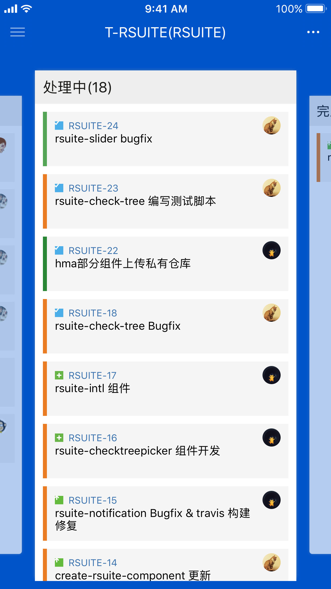
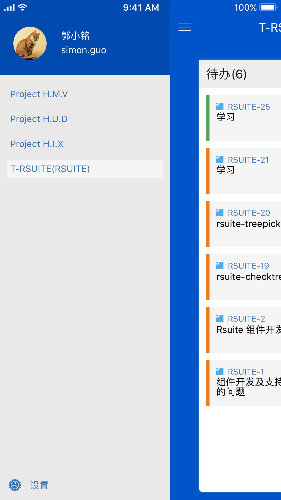
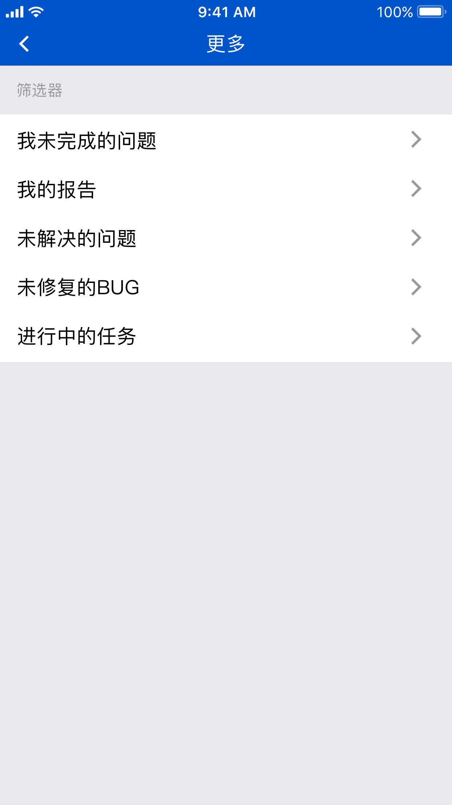
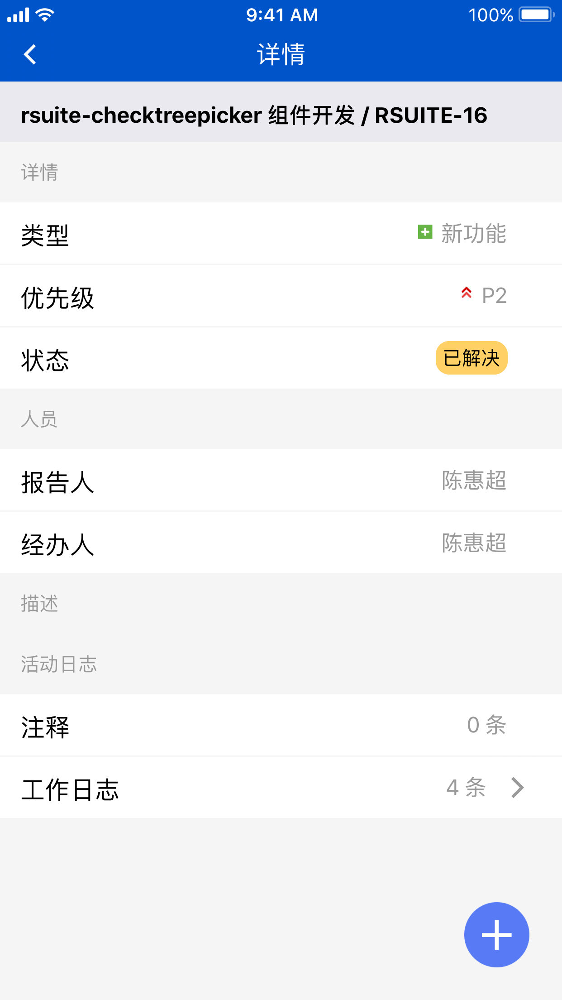

# JIRA Do

JIRA Do 是 JIRA 的一个客户端，可以登录到 JIRA Cloud 或者公司内部 JIRA 平台。
协助你随时随地掌握产品进度，登记工作日志。

## Install

[iOS](https://itunes.apple.com/cn/app/jira-do/id1453143910?mt=8)

[Android](https://github.com/hypers/JiraAgileApp/raw/master/android/release/jira-do.apk)

## Preview

    

